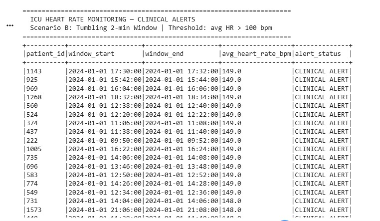

# Real-time-Processing-Engines

# ICU Heart Rate Monitoring — Spark Structured Streaming

**Course**: ENGR 5785G: Real-time Data Analytics for IoT  
**Scenario**: B — Hospital Patient Monitoring  
**Window Type**: Tumbling 2-minute window  

## Dataset
IoMT Health Monitoring dataset (Kaggle) — 50,000 patient heart rate readings.  
Synthetic timestamps added (one reading every 30 seconds per patient).

## How to Run

### 1. Open the notebook in Google Colab
Upload `ICU_HeartRate_Monitor.ipynb` to Google Colab.

### 2. Upload the dataset
When prompted, upload `patients_data_with_alerts.xlsx`.

### 3. Run all cells in order
- **Cell 1**: Install PySpark
- **Cell 2**: Upload and convert dataset to CSV with timestamps
- **Cell 3**: Quick data check
- **Cell 4**: Split into 500 micro-batch files
- **Cell 5**: Define and start Spark Structured Streaming query
- **Cell 6**: Feed batches into stream and display alerts

### 4. Expected Output
A table of clinical alerts with columns:
- `patient_id` — patient identifier
- `window_start` / `window_end` — 2-minute tumbling window bounds
- `avg_heart_rate_bpm` — average heart rate in the window
- `alert_status` — CLINICAL ALERT (fired when avg HR > 100 bpm)

## Pipeline Architecture

| Stage | Details |
|-------|---------|
| Source | CSV files via watched directory (`readStream`) |
| Watermark | 2-minute event-time watermark on timestamp |
| Window | Tumbling 2-minute window, grouped by `patient_id` |
| Aggregation | `avg(heart_rate)` per window |
| Alert Filter | `avg_heart_rate > 100 bpm` |
| Sink | Memory sink → queried via `spark.sql()` |

